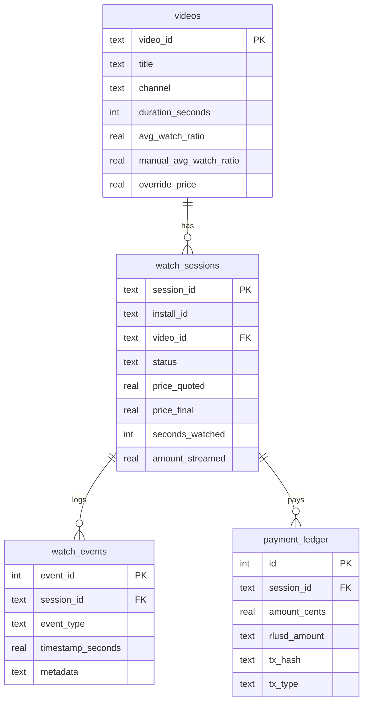
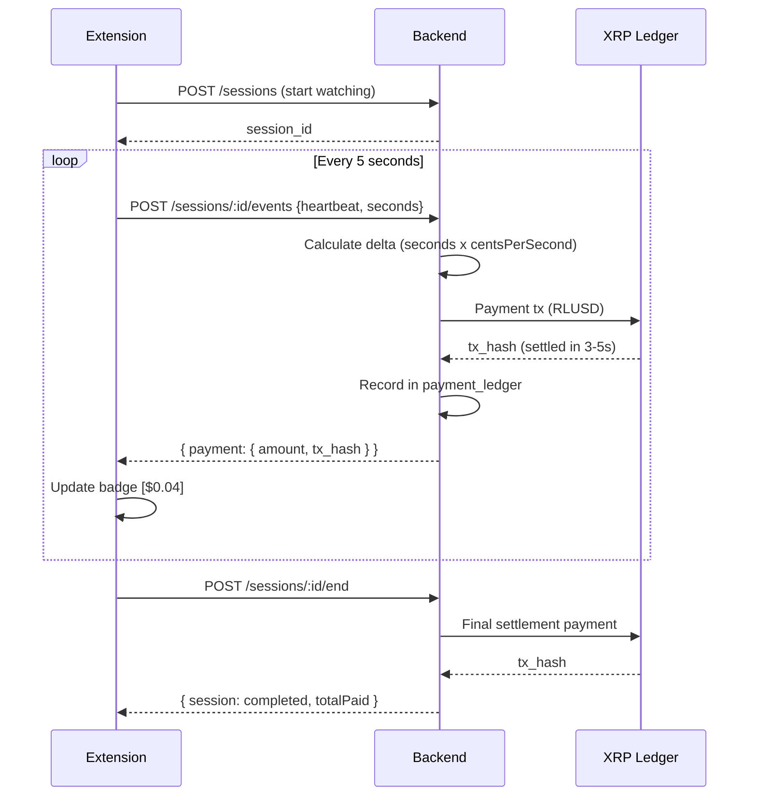

<p align="center">
  <br />
  <picture>
    <source media="(prefers-color-scheme: dark)" srcset="https://img.shields.io/badge/StreamFair-Pay_Only_For_What_You_Watch-1f7cff?style=for-the-badge&labelColor=0a0a1a">
    
  </picture>
</p>

<h1 align="center">StreamFair</h1>

<p align="center">
  <strong>Real-time micro-payments for video streaming, powered by XRP Ledger</strong>
</p>

<p align="center">
  <a href="#-the-problem">Problem</a> &middot;
  <a href="#-how-it-works">How It Works</a> &middot;
  <a href="#-quick-start">Quick Start</a> &middot;
  <a href="#%EF%B8%8F-architecture">Architecture</a> &middot;
  <a href="#-api-reference">API</a> &middot;
  <a href="#-contributing">Contributing</a>
</p>

<p align="center">
  
  
  
  
  
  
  
</p>

---

## The Problem

Streaming platforms today operate on an **all-or-nothing** model. You pay a flat monthly subscription whether you watch 200 hours or 2. Creators get paid through opaque algorithms that don't directly correlate with how much value viewers get from their content.

This creates three fundamental issues:

| Who | Problem |
|---|---|
| **Viewers** | Overpay for content they barely use, subsidize content they never watch |
| **Creators** | Revenue is decoupled from actual viewer engagement and value delivered |
| **The Market** | No price signal exists to reflect *how much* of a video is actually worth watching |

> What if you could pay a creator *exactly* for what you watched, streamed in real-time, settled on a decentralized ledger?

---

## The Solution

**StreamFair** is a browser extension + backend system that introduces **per-second streaming payments** for video content using **RLUSD** (Ripple's USD stablecoin) on the **XRP Ledger**.

Instead of subscriptions, viewers pay micro-amounts in real-time as they watch. Close the video halfway? You paid for half. The price itself is shaped by community engagement -- if most people only watch 30% of a video, the price adjusts to reflect that.

### Why XRP Ledger?

We needed a payment rail that could handle **frequent, tiny transactions** with **near-instant settlement** and **negligible fees**. The XRP Ledger delivers all three:

| Requirement | XRPL Capability |
|---|---|
| **Micro-payments** (fractions of a cent) | Transactions settle for ~0.00001 XRP (~$0.00002) |
| **Speed** (payments every 5 seconds) | 3-5 second ledger close time |
| **Stablecoin support** | Native RLUSD token via trustlines -- no smart contract needed |
| **Reliability** | 10+ years of continuous operation, no downtime |
| **Developer experience** | First-class `xrpl.js` SDK with WebSocket streaming |

Payments are denominated in **RLUSD** (Ripple USD), so viewers and creators deal in familiar dollar amounts while settling on a decentralized ledger. Every transaction is verifiable on-chain with a permanent `tx_hash`.

---

## Features

- **Per-second pricing** -- charges accrue only while the video is playing
- **Streaming payments** -- RLUSD micro-payments sent every 5 seconds via XRPL
- **Community-driven pricing** -- average watch ratio across all viewers dynamically adjusts the price
- **Multi-platform** -- works on YouTube and Amazon Prime Video
- **Wallet onboarding** -- generate a new XRPL testnet wallet or import an existing one, right from the extension
- **Session history** -- popup UI shows full transaction history with amounts, durations, and statuses
- **Admin dashboard** -- override prices, adjust watch ratios, inspect sessions
- **On-chain audit trail** -- every payment recorded with XRPL transaction hash

---

## How It Works

### The Payment Flow

```
 Viewer opens a video
         |
         v
 ┌───────────────────┐
 │   Pricing Gate     │  Extension fetches price from backend
 │   $0.24 for 2min   │  (base rate x community watch ratio)
 │                     │
 │  [Start]  [Decline] │
 └────────┬────────────┘
          |  Viewer clicks Start
          v
 ┌────────────────────────────────────────────┐
 │              Active Session                 │
 │                                             │
 │  Every 1s:  accumulate watch time           │
 │  Every 5s:  send heartbeat to backend ───────────> Backend calculates
 │             with seconds watched            │      prorated delta
 │                                             │           |
 │  Badge shows live cost: [$0.04]             │           v
 │                                             │   XRPL Payment (RLUSD)
 │                                             │   Sender ──> Receiver
 │                                             │   tx_hash recorded
 └────────────────┬───────────────────────────┘
                  |  Video ends / viewer stops
                  v
 ┌───────────────────────────┐
 │    Session Complete        │
 │    Final settlement sent   │  Remaining balance paid
 │    Total: $0.18 for 1:32   │  Session marked 'completed'
 └───────────────────────────┘
```

### Pricing Formula

```
totalPrice = basePrice x (avgWatchRatio / 100)
```

Where:
- **basePrice** = `0.2 cents/second x duration` (or admin override)
- **avgWatchRatio** = average percentage of the video watched across all viewers (0-100)

This means: if a 10-minute video has a community watch ratio of 60%, the price is 60% of the base. Content that people actually finish costs more. Content people abandon costs less. The market speaks.

---

## Quick Start

### Prerequisites

- **Node.js** >= 18
- **npm** >= 9
- **Google Chrome** (or Chromium-based browser)

### 1. Clone and install

```bash
git clone https://github.com/your-username/streamfair.git
cd streamfair
npm install
```

### 2. Set up XRPL testnet wallets

```bash
npx ts-node backend/scripts/xrpl-setup.ts
```

This script will:
- Create two XRPL testnet wallets (viewer + creator)
- Fund them from the testnet faucet
- Establish RLUSD trustlines
- Generate a `.env` file with all credentials

### 3. Start the backend

```bash
npm run dev:backend
```

The API server starts at `http://localhost:4000`. On first run, SQLite migrations run automatically.

### 4. Build and load the extension

```bash
npm run build:extension
```

Then in Chrome:
1. Navigate to `chrome://extensions`
2. Enable **Developer mode** (top right)
3. Click **Load unpacked**
4. Select the `extension/dist` folder

### 5. Onboard your wallet

Click the StreamFair extension icon and complete the wallet setup wizard -- you can generate a new testnet wallet or import an existing seed.

### 6. Watch a video

Open any YouTube or Prime Video page. The pricing gate appears over the video. Click **Start Watching** and payments begin streaming.

---

## Architecture

```
┌─────────────────────────────────────────────────────┐
│                  Chrome Extension                     │
│                  (Manifest V3)                        │
│                                                       │
│  ┌─────────────┐  ┌──────────┐  ┌────────────────┐  │
│  │ Content      │  │ Service  │  │ Popup          │  │
│  │ Script       │  │ Worker   │  │ (History UI)   │  │
│  │             │  │          │  │                │  │
│  │ - Gate UI   │  │ - CORS   │  │ - Tx history   │  │
│  │ - Meter     │  │   proxy  │  │ - Total spent  │  │
│  │ - Badge     │  │ - Wallet │  │ - Session list │  │
│  │ - Platform  │  │   store  │  │                │  │
│  │   detect    │  │ - Badge  │  │                │  │
│  └──────┬──────┘  └────┬─────┘  └────────────────┘  │
│         │              │                              │
└─────────┼──────────────┼──────────────────────────────┘
          │   REST API   │
          └──────┬───────┘
                 │
    ┌────────────▼────────────────────────────┐
    │         Backend (Express + TypeScript)    │
    │                                          │
    │  Routes         Services       Database  │
    │  ┌──────────┐  ┌───────────┐  ┌───────┐ │
    │  │ /price   │  │ Pricing   │  │SQLite │ │
    │  │ /sessions│  │ Engine    │  │       │ │
    │  │ /xrpl    │  │           │  │Videos │ │
    │  │ /onboard │  │ XRPL      │  │Sessns │ │
    │  │ /admin   │  │ Payment   │  │Events │ │
    │  │          │  │ Provider  │  │Ledger │ │
    │  └──────────┘  └─────┬─────┘  └───────┘ │
    │                      │                   │
    └──────────────────────┼───────────────────┘
                           │  WebSocket
                           │
              ┌────────────▼──────────────┐
              │     XRP Ledger Testnet     │
              │                            │
              │  RLUSD Token Payments      │
              │  Sender ────> Receiver     │
              │  (viewer)     (creator)    │
              │                            │
              │  Settlement: 3-5 seconds   │
              │  Fee: ~0.00001 XRP         │
              └────────────────────────────┘
```

### Component Breakdown

| Component | Tech | Role |
|---|---|---|
| **Content Script** | TypeScript, Shadow DOM | Detects videos, renders pricing gate, meters watch time |
| **Service Worker** | Chrome MV3 Background | Proxies API calls (CORS), stores wallet credentials |
| **Popup** | HTML + TypeScript | Displays session history and total spend |
| **Onboarding** | HTML + TypeScript | Multi-step wallet setup wizard |
| **Backend API** | Express.js, TypeScript | Pricing, sessions, payment orchestration |
| **Pricing Engine** | Pure function | Computes price from base rate + community ratio |
| **Payment Provider** | xrpl.js v4 | Connects to XRPL, signs + submits RLUSD payments |
| **Database** | SQLite (better-sqlite3) | Videos, sessions, events, payment ledger |

### Platform Support

The extension uses a **platform abstraction layer** to support multiple streaming sites:

```typescript
interface PlatformUtils {
  platform: 'youtube' | 'prime' | 'unknown';
  getVideoId(): string | null;
  getVideoElement(): HTMLVideoElement | null;
  getPlayerContainer(): HTMLElement | null;
  getVideoTitle(): string;
  getChannelName(): string;
  isAdPlaying(): boolean;
  onNavigate(callback: () => void): void;
}
```

| Platform | Video ID Source | Navigation Detection |
|---|---|---|
| **YouTube** | URL param `v=` | `yt-navigate-finish` event |
| **Prime Video** | ASIN from URL path | URL polling (SPA) |

---

## Project Structure

```
streamfair/
├── backend/
│   ├── src/
│   │   ├── db/
│   │   │   ├── connection.ts         # SQLite setup (WAL mode, foreign keys)
│   │   │   ├── migrate.ts            # Auto-migration runner
│   │   │   └── migrations/           # SQL migration files
│   │   ├── models/
│   │   │   ├── video.ts              # Video CRUD + pricing queries
│   │   │   ├── session.ts            # Session lifecycle management
│   │   │   └── event.ts              # Watch event logging
│   │   ├── services/
│   │   │   ├── payment-provider.ts   # XRPL integration (singleton)
│   │   │   └── pricing.ts            # Price computation engine
│   │   ├── routes/
│   │   │   ├── price.ts              # GET /api/videos/:id/price
│   │   │   ├── sessions.ts           # Session CRUD + streaming events
│   │   │   ├── xrpl.ts               # XRPL status + payment history
│   │   │   ├── admin.ts              # Admin dashboard + overrides
│   │   │   └── onboarding.ts         # Wallet creation + import
│   │   ├── middleware/
│   │   │   ├── install-id.ts         # X-Install-Id header extraction
│   │   │   └── admin-auth.ts         # Token-based admin auth
│   │   ├── views/
│   │   │   └── admin.html            # Admin dashboard UI
│   │   ├── app.ts                    # Express app configuration
│   │   └── index.ts                  # Server entry point
│   ├── scripts/
│   │   └── xrpl-setup.ts            # Testnet wallet provisioning
│   └── data/
│       └── streamfair.db            # SQLite database (auto-created)
│
├── extension/
│   ├── src/
│   │   ├── background/
│   │   │   └── service-worker.ts     # Message handler, wallet store
│   │   ├── content/
│   │   │   ├── main.ts               # Video detection orchestrator
│   │   │   ├── gate.ts               # Pricing gate overlay (Shadow DOM)
│   │   │   ├── meter.ts              # Watch time + heartbeat loop
│   │   │   ├── badge.ts              # Extension badge with live cost
│   │   │   ├── platform.ts           # Platform abstraction layer
│   │   │   ├── youtube-utils.ts      # YouTube-specific selectors
│   │   │   └── prime-utils.ts        # Prime Video-specific selectors
│   │   ├── popup/
│   │   │   └── popup.ts              # Transaction history UI
│   │   ├── onboarding/
│   │   │   └── onboarding.ts         # Wallet setup wizard
│   │   └── shared/
│   │       ├── api-client.ts         # REST client via service worker
│   │       ├── types.ts              # Shared TypeScript interfaces
│   │       └── constants.ts          # API URL, intervals, theme
│   └── dist/                         # Built extension (load in Chrome)
│
├── static/
│   └── extension/
│       ├── manifest.json             # Chrome MV3 manifest
│       ├── popup.html                # Popup shell
│       ├── onboarding.html           # Onboarding shell
│       └── icons/                    # Extension icons (16/48/128)
│
├── .env                              # XRPL testnet config (generated)
└── package.json                      # Workspace root
```

---

## Database Schema

StreamFair uses SQLite with WAL mode for concurrent reads. The schema evolves through numbered SQL migrations that run automatically on startup.



---

## API Reference

### Price

| Method | Endpoint | Description |
|---|---|---|
| `GET` | `/api/videos/:id/price?title=...&channel=...&duration=...` | Get price for a video |

**Response:**
```json
{
  "videoId": "dQw4w9WgXcQ",
  "priceCents": 144,
  "centsPerSecond": 0.2,
  "avgWatchRatio": 60,
  "durationSeconds": 212
}
```

### Sessions

| Method | Endpoint | Description |
|---|---|---|
| `POST` | `/api/sessions` | Create a new watch session |
| `POST` | `/api/sessions/decline` | Decline and log a skipped video |
| `GET` | `/api/sessions/history` | Get session history for a user |
| `POST` | `/api/sessions/:id/events` | Log a watch event (play/pause/heartbeat/end) |
| `POST` | `/api/sessions/:id/end` | End session and send final settlement |

All session endpoints require the `X-Install-Id` header.

### XRPL

| Method | Endpoint | Description |
|---|---|---|
| `GET` | `/api/xrpl/status` | Connection status + wallet balances |
| `GET` | `/api/xrpl/payments` | All payment ledger entries |
| `GET` | `/api/xrpl/payments/:sessionId` | Payments for a specific session |

### Onboarding

| Method | Endpoint | Description |
|---|---|---|
| `POST` | `/api/onboarding/create-wallet` | Generate new XRPL testnet wallet |
| `POST` | `/api/onboarding/import-wallet` | Import wallet from seed |
| `POST` | `/api/onboarding/set-trustline` | Establish RLUSD trustline |
| `POST` | `/api/onboarding/claim-rlusd` | Claim test RLUSD from faucet |
| `GET` | `/api/onboarding/status?address=...` | Wallet status + balances |

### Admin

| Method | Endpoint | Description |
|---|---|---|
| `GET` | `/admin` | Admin dashboard (HTML) |
| `GET` | `/api/admin/videos` | List all tracked videos |
| `PUT` | `/api/admin/videos/:id/override` | Set override price |
| `PUT` | `/api/admin/videos/:id/ratio` | Set manual watch ratio |

Admin endpoints require `X-Admin-Token` header.

---

## Configuration

### Environment Variables

Generated by `scripts/xrpl-setup.ts`:

| Variable | Description |
|---|---|
| `XRPL_TESTNET` | Enable testnet mode (`true`) |
| `XRPL_WS_URL` | XRPL WebSocket endpoint |
| `XRPL_RLUSD_CURRENCY` | RLUSD currency hex code |
| `XRPL_RLUSD_ISSUER` | RLUSD issuer address on XRPL |
| `XRPL_SENDER_SEED` | Viewer wallet seed (server fallback) |
| `XRPL_SENDER_ADDRESS` | Viewer wallet address |
| `XRPL_RECEIVER_SEED` | Creator wallet seed |
| `XRPL_RECEIVER_ADDRESS` | Creator wallet address |
| `PORT` | Backend server port (default: `4000`) |

### Extension Constants

| Constant | Value | Description |
|---|---|---|
| `HEARTBEAT_INTERVAL_MS` | `5000` | Payment frequency |
| `METER_TICK_MS` | `1000` | Watch time accumulation tick |
| `API_BASE` | `http://localhost:4000/api` | Backend URL |

---

## Development

### Backend

```bash
npm run dev:backend          # Start with auto-reload (nodemon)
```

The backend uses `nodemon` + `ts-node` for hot reload during development. SQLite database is created at `backend/data/streamfair.db` on first run.

### Extension

```bash
npm run build:extension      # Bundle with esbuild
```

After building, reload the extension in `chrome://extensions` to pick up changes.

### XRPL Setup

```bash
npx ts-node backend/scripts/xrpl-setup.ts
```

Creates fresh testnet wallets, funds them, establishes RLUSD trustlines, and writes `.env`. Run this once during initial setup or if wallets need to be regenerated.

---

## Tech Stack

| Layer | Technology | Why |
|---|---|---|
| **Language** | TypeScript | Type safety across the entire stack |
| **Backend** | Express.js | Lightweight, well-understood HTTP framework |
| **Database** | SQLite (better-sqlite3) | Zero-config, single-file, WAL mode for concurrency |
| **Blockchain** | XRP Ledger + xrpl.js v4 | Fast settlement, low fees, native stablecoin support |
| **Stablecoin** | RLUSD | USD-pegged token on XRPL -- viewers pay in dollars |
| **Extension** | Chrome Manifest V3 | Modern extension platform with service workers |
| **Build** | esbuild | Sub-second extension builds |
| **UI** | Shadow DOM | Style isolation from host page |
| **Monorepo** | npm workspaces | Single install, shared deps |

---

## How XRPL Payments Work

A deeper look at the on-chain payment flow:



Each XRPL transaction includes:
- **Amount**: RLUSD value (e.g., `"0.040000"`)
- **Destination**: Creator's XRPL address
- **Memo**: Session context for audit trail
- **Result**: `tesSUCCESS` confirms on-ledger settlement

---

## Roadmap

- [ ] Mainnet deployment with real RLUSD
- [ ] Creator dashboard with earnings analytics
- [ ] Multi-creator payment splitting
- [ ] Firefox and Edge extension support
- [ ] Payment channels for even lower fees at scale
- [ ] Creator-set pricing tiers
- [ ] Viewer reputation and loyalty rewards
- [ ] Mobile browser support

---

## Contributing

Contributions are welcome! Here's how to get started:

1. Fork the repository
2. Create a feature branch (`git checkout -b feature/amazing-feature`)
3. Run the XRPL setup script to provision testnet wallets
4. Make your changes
5. Test with the extension loaded in Chrome
6. Commit your changes (`git commit -m 'Add amazing feature'`)
7. Push to the branch (`git push origin feature/amazing-feature`)
8. Open a Pull Request

### Areas Where Help is Needed

- Additional streaming platform support (Twitch, Vimeo, etc.)
- Improved pricing algorithms
- Test coverage
- UI/UX refinements
- Documentation and tutorials

---

## License

This project is licensed under the MIT License. See `LICENSE` for details.

---

## Acknowledgements

- [XRP Ledger](https://xrpl.org/) -- the blockchain powering StreamFair's payment layer
- [RLUSD](https://ripple.com/solutions/stablecoin/) -- Ripple's USD stablecoin for familiar-denomination payments
- [xrpl.js](https://github.com/XRPLF/xrpl.js) -- official JavaScript SDK for XRP Ledger
- [esbuild](https://esbuild.github.io/) -- blazing-fast bundler for the extension
- [better-sqlite3](https://github.com/WiseLibs/better-sqlite3) -- synchronous SQLite for Node.js

---

<p align="center">
  <sub>Built for a fairer streaming economy.</sub>
</p>
