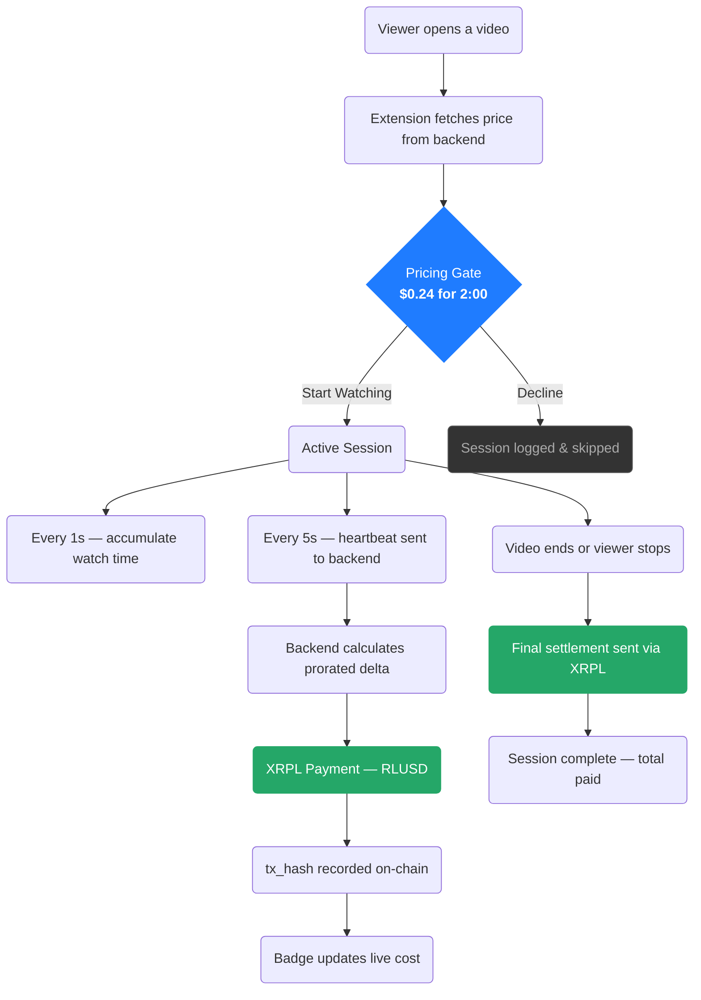
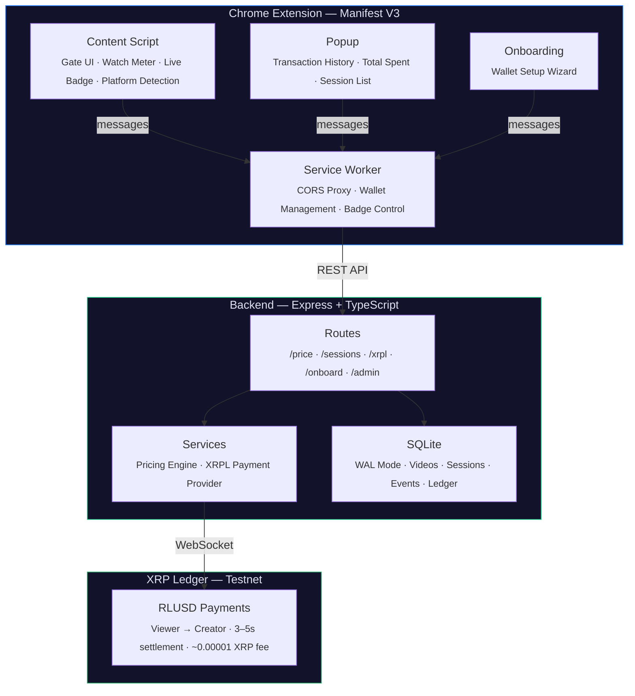
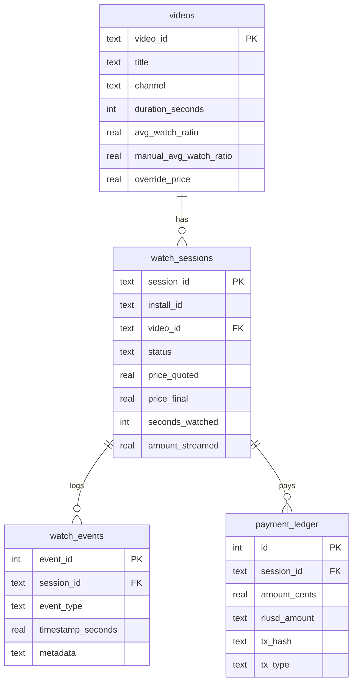

<div align="center">

# StreamFair

**Stop subscribing. Start streaming payments.**

Real-time, per-second micro-payments for video content — settled on-chain via RLUSD on the XRP Ledger.

[](https://www.typescriptlang.org/)
[](https://xrpl.org/)
[](https://ripple.com/solutions/stablecoin/)
[](#)
[](https://expressjs.com/)
[](https://www.sqlite.org/)
[](LICENSE)

[Problem](#the-problem) ·
[Solution](#the-solution) ·
[Quick Start](#quick-start) ·
[Architecture](#architecture) ·
[API](#api-reference) ·
[Roadmap](#roadmap)

</div>

---

## The Problem

Streaming platforms operate on an all-or-nothing subscription model. Viewers pay the same flat fee whether they watch 200 hours or 2. Creators are compensated through opaque algorithms disconnected from actual viewer engagement.

| Stakeholder | Pain Point |
|:--|:--|
| **Viewers** | Overpay for content they barely consume |
| **Creators** | Revenue has no direct link to value delivered |
| **The Market** | No price signal reflects how much of a video is actually worth watching |

---

## The Solution

StreamFair is a **Chrome extension + backend** that replaces subscriptions with **per-second streaming payments** using [RLUSD](https://ripple.com/solutions/stablecoin/) (Ripple's USD stablecoin) on the [XRP Ledger](https://xrpl.org/).

Viewers pay micro-amounts in real-time as they watch. Close the tab at 50%? You paid for 50%. Pricing is shaped by community engagement — if most people only watch 30% of a video, the price adjusts down automatically.

Every transaction is settled on-chain with a permanent, verifiable `tx_hash`.

### Why XRPL?

| Requirement | XRPL Delivers |
|:--|:--|
| Micro-payments (fractions of a cent) | ~$0.00002 per transaction fee |
| High frequency (every 5 seconds) | 3–5 second ledger close time |
| Stablecoin support | Native RLUSD via trustlines — no smart contracts |
| Reliability | 10+ years continuous uptime |
| Developer experience | First-class `xrpl.js` SDK with WebSocket streaming |

---

## Key Features

| Feature | Description |
|:--|:--|
| **Per-second pricing** | Charges accrue only while the video is playing |
| **Streaming payments** | RLUSD micro-payments sent every 5 seconds via XRPL |
| **Community-driven pricing** | Average watch ratio across all viewers dynamically adjusts the price |
| **Multi-platform** | YouTube and Amazon Prime Video |
| **In-browser wallet** | Generate or import an XRPL wallet directly in the extension |
| **Session history** | Full transaction log with amounts, durations, and on-chain hashes |
| **Admin dashboard** | Override prices, adjust watch ratios, inspect sessions |
| **On-chain audit trail** | Every payment permanently recorded on the XRP Ledger |

---

## How It Works

### Payment Flow



### Pricing Formula

```
totalPrice = basePrice × (avgWatchRatio / 100)
```

| Parameter | Definition |
|:--|:--|
| **basePrice** | `0.2 cents/second × duration` (or admin override) |
| **avgWatchRatio** | Average % of the video watched across all viewers (0–100) |

A 10-minute video with a 60% community watch ratio costs 60% of the base price. Content people finish costs more. Content people abandon costs less.

---

## Quick Start

### Prerequisites

| Requirement | Version |
|:--|:--|
| Node.js | >= 18 |
| npm | >= 9 |
| Browser | Chrome or Chromium-based |

### Setup

```bash
# 1. Clone and install
git clone https://github.com/your-username/streamfair.git
cd streamfair
npm install

# 2. Provision XRPL testnet wallets (generates .env automatically)
npx ts-node backend/scripts/xrpl-setup.ts

# 3. Start the backend (http://localhost:4000)
npm run dev:backend

# 4. Build the extension (in a second terminal)
npm run build:extension
```

### Load the Extension

1. Open `chrome://extensions`
2. Enable **Developer mode** (top right)
3. Click **Load unpacked** → select the `extension/dist` folder
4. Click the StreamFair icon → complete the wallet setup wizard

### Get Test RLUSD

After running the setup script, fund your wallets with test tokens:

1. Go to [tryrlusd.com](https://tryrlusd.com/)
2. Select **XRPL Testnet**
3. Claim RLUSD for the wallet addresses printed by the setup script

Open any YouTube or Prime Video page — the pricing gate appears, and payments begin streaming when you click **Start Watching**.

---

## Architecture



### Components

| Component | Technology | Responsibility |
|:--|:--|:--|
| Content Script | TypeScript, Shadow DOM | Video detection, pricing gate, watch metering |
| Service Worker | Chrome MV3 | CORS proxy, wallet storage, badge control |
| Popup | HTML + TypeScript | Session history, spend tracking |
| Onboarding | HTML + TypeScript | Multi-step wallet setup wizard |
| Backend API | Express.js | Pricing, session orchestration, payment dispatch |
| Pricing Engine | Pure function | Price computation from base rate + community ratio |
| Payment Provider | xrpl.js v4 | XRPL connection, transaction signing + submission |
| Database | SQLite (better-sqlite3) | Videos, sessions, events, payment ledger |

### Platform Support

| Platform | Video ID Source | Navigation Detection |
|:--|:--|:--|
| YouTube | URL param `v=` | `yt-navigate-finish` event |
| Prime Video | ASIN from URL path | URL polling (SPA) |

---

## On-Chain Settlement

```mermaid
sequenceDiagram
    participant Ext as Extension
    participant API as Backend
    participant XRPL as XRP Ledger

    Ext->>API: POST /sessions
    API-->>Ext: session_id

    rect rgb(18, 18, 42)
    note right of Ext: Streaming loop
    loop Every 5 seconds
        Ext->>API: POST /sessions/:id/events
        API->>API: Calculate prorated delta
        API->>XRPL: RLUSD payment tx
        XRPL-->>API: tx_hash (3–5s)
        API-->>Ext: { amount, tx_hash }
    end
    end

    Ext->>API: POST /sessions/:id/end
    API->>XRPL: Final settlement
    XRPL-->>API: tx_hash
    API-->>Ext: { completed, totalPaid }
```



**Each on-chain transaction contains:**

| Field | Value |
|:--|:--|
| **Amount** | RLUSD (e.g. `0.040000`) |
| **Destination** | Creator's XRPL address |
| **Memo** | Session ID for audit trail |
| **Result** | `tesSUCCESS` — confirmed on-ledger |

---

## API Reference

### Pricing

| Method | Endpoint | Description |
|:--|:--|:--|
| `GET` | `/api/videos/:id/price` | Get price for a video (query: `title`, `channel`, `duration`) |

### Sessions

| Method | Endpoint | Description |
|:--|:--|:--|
| `POST` | `/api/sessions` | Create a watch session |
| `POST` | `/api/sessions/decline` | Log a declined video |
| `GET` | `/api/sessions/history` | Session history for a user |
| `POST` | `/api/sessions/:id/events` | Log watch event (play/pause/heartbeat/end) |
| `POST` | `/api/sessions/:id/end` | End session + final settlement |

All session endpoints require the `X-Install-Id` header.

### XRPL

| Method | Endpoint | Description |
|:--|:--|:--|
| `GET` | `/api/xrpl/status` | Connection status + wallet balances |
| `GET` | `/api/xrpl/payments` | All payment ledger entries |
| `GET` | `/api/xrpl/payments/:sessionId` | Payments for a specific session |

### Onboarding

| Method | Endpoint | Description |
|:--|:--|:--|
| `POST` | `/api/onboarding/create-wallet` | Generate new XRPL testnet wallet |
| `POST` | `/api/onboarding/import-wallet` | Import wallet from seed |
| `POST` | `/api/onboarding/set-trustline` | Establish RLUSD trustline |
| `POST` | `/api/onboarding/claim-rlusd` | Claim test RLUSD |
| `GET` | `/api/onboarding/status` | Wallet status + balances (query: `address`) |

### Admin

| Method | Endpoint | Description |
|:--|:--|:--|
| `GET` | `/admin` | Admin dashboard |
| `GET` | `/api/admin/videos` | List all tracked videos |
| `PUT` | `/api/admin/videos/:id/override` | Set/clear override price |
| `PUT` | `/api/admin/videos/:id/ratio` | Set/clear manual watch ratio |

Admin endpoints require the `X-Admin-Token` header.

---

## Database Schema

SQLite with WAL mode. Migrations run automatically on startup.



---

## Configuration

### Environment Variables

Auto-generated by `scripts/xrpl-setup.ts`:

| Variable | Description |
|:--|:--|
| `XRPL_TESTNET` | Enable testnet mode |
| `XRPL_WS_URL` | XRPL WebSocket endpoint |
| `XRPL_RLUSD_CURRENCY` | RLUSD currency hex code |
| `XRPL_RLUSD_ISSUER` | RLUSD issuer address |
| `XRPL_SENDER_SEED` | Viewer wallet seed |
| `XRPL_SENDER_ADDRESS` | Viewer wallet address |
| `XRPL_RECEIVER_SEED` | Creator wallet seed |
| `XRPL_RECEIVER_ADDRESS` | Creator wallet address |
| `PORT` | Server port (default: `4000`) |

### Extension Constants

| Constant | Value | Purpose |
|:--|:--|:--|
| `HEARTBEAT_INTERVAL_MS` | `5000` | Payment frequency |
| `METER_TICK_MS` | `1000` | Watch time accumulation |
| `API_BASE` | `http://localhost:4000/api` | Backend endpoint |

---

## Project Structure

```
streamfair/
├── backend/
│   ├── src/
│   │   ├── db/                  # SQLite connection, migrations
│   │   ├── models/              # Video, session, event CRUD
│   │   ├── services/            # XRPL payment provider, pricing engine
│   │   ├── routes/              # REST endpoints (price, sessions, xrpl, admin, onboarding)
│   │   ├── middleware/          # Install ID extraction, admin auth
│   │   ├── views/               # Admin dashboard HTML
│   │   ├── app.ts               # Express configuration
│   │   └── index.ts             # Server entry point
│   └── scripts/
│       └── xrpl-setup.ts        # Testnet wallet provisioning
│
├── extension/
│   ├── src/
│   │   ├── background/          # Service worker (message handling, wallet store)
│   │   ├── content/             # Video detection, gate, meter, badge, platform layer
│   │   ├── popup/               # Transaction history UI
│   │   ├── onboarding/          # Wallet setup wizard
│   │   └── shared/              # API client, types, constants
│   └── dist/                    # Built extension (load in Chrome)
│
├── static/extension/            # Manifest, HTML shells, icons
├── .env                         # XRPL credentials (auto-generated)
└── package.json                 # npm workspaces root
```

---

## Tech Stack

| Layer | Technology | Rationale |
|:--|:--|:--|
| Language | TypeScript | Type safety across the full stack |
| Backend | Express.js | Lightweight, well-understood HTTP framework |
| Database | SQLite (better-sqlite3) | Zero-config, single-file, WAL concurrency |
| Blockchain | XRP Ledger + xrpl.js v4 | Fast settlement, low fees, native stablecoin support |
| Stablecoin | RLUSD | USD-pegged — viewers and creators deal in dollars |
| Extension | Chrome Manifest V3 | Modern extension platform with service workers |
| Build | esbuild | Sub-second extension bundling |
| UI Isolation | Shadow DOM | Style encapsulation on host pages |
| Monorepo | npm workspaces | Single install, shared dependencies |

---

## Roadmap

- [ ] Mainnet deployment with real RLUSD
- [ ] Creator dashboard with earnings analytics
- [ ] Multi-creator payment splitting
- [ ] Firefox and Edge extension support
- [ ] XRPL payment channels for reduced fees at scale
- [ ] Creator-set pricing tiers
- [ ] Viewer reputation and loyalty rewards
- [ ] Mobile browser support

---

## Collaborators

- **Yash Nakadi**
- **Aryan Mudgal**
- **Ayush Srivastava**

---

## License

This project is licensed under the [MIT License](LICENSE).

---

<p align="center">
  <sub>Built for a fairer streaming economy.</sub>
</p>
